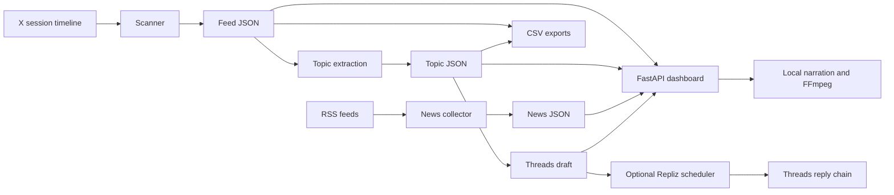

# Architecture

The Python package has one module per pipeline feature. `config.py` owns shared
paths, the Jakarta calendar, and atomic JSON persistence. `cli.py` exposes the
same implementations to scripts, development, cron, and native deployment.
Compatibility launchers remain at the root for existing jobs.

`pipeline.py` starts each stage using the current Python interpreter, obtains a
nonblocking Linux file lock, logs each stage, and propagates failures. It writes
explicit run/failure/completion markers. `web/pipeline_status.py` combines these
markers with artifact existence and JSON readability; an incomplete run is
pending, a failed stage is failed, and a completed run missing output is failed.

Artifacts live outside the installed package. Pipeline and web processes use the
same `DATA_DIR` and `DATASET_DIR`. Importing a module does not create directories
or read credentials. The demo supplies fictional inputs to the normal collection,
topic, draft, and dataset implementations. Runtime API calls stay behind tests'
network guards and mocks.

`repliz.py` validates the exact requested draft date, account connection, publish
time, and Repliz's UTF-8 text budget before scheduling a text post and ordered
replies. Preview requires no API credentials and performs no network calls.
Submission uses server-side Basic Auth against a fixed HTTPS origin. Atomic
receipts and an account/day file lock prevent repeat submissions from the same
shared `DATA_DIR`. A pending or unknown outcome requires dashboard reconciliation
before retrying, because Repliz does not document an idempotency key. An accepted
schedule is not proof that Threads has published it. Automatic scheduling is an
explicit opt-in after the normal stages; failures propagate to the pipeline.

Templates ship inside the wheel, so the server can start outside the checkout.
The dashboard reads JSON rather than requiring a database. Chat and optional
media services are isolated in the web feature. Video generation uses local TTS
by default; online TTS is an explicit extra and backend choice. External footage
is optional. The manual renderer accepts reviewed local assets and produces
subtitle and credit sidecars.

The optional Node summarizer is independent of Python. It uses Node's built-in
test runner and requires Node 22+. Cookie mode also needs a compatible Chrome
installation; API mode needs an X user access token. Both are external integration
requirements, not prerequisites for running the dashboard or offline demo.

Deployment is a single non-root web container plus mounted artifacts. Ingress is
optional and separate; the default Compose service binds to localhost. Native
deployment uses separate scanner and web accounts with systemd restrictions.
Neither deployment path requires the original user's home directory or unrelated
services. GitHub Actions runs quality checks, package checks, and a demo smoke test
on clean runners using pinned actions and locked dependencies.
